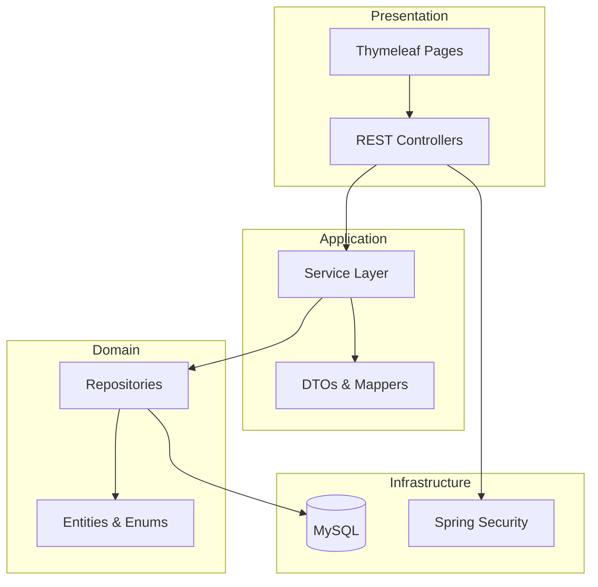
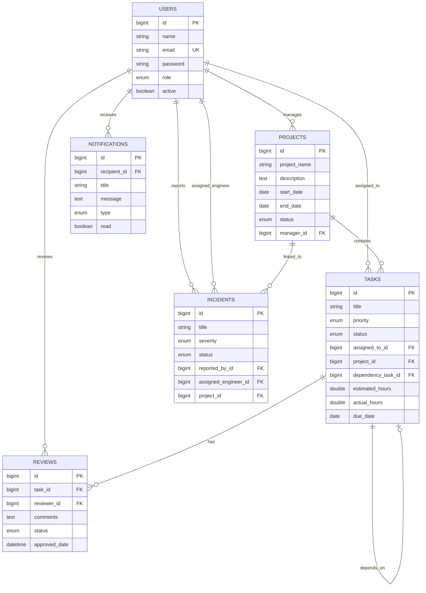
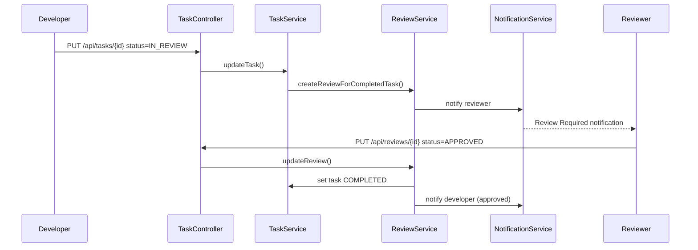
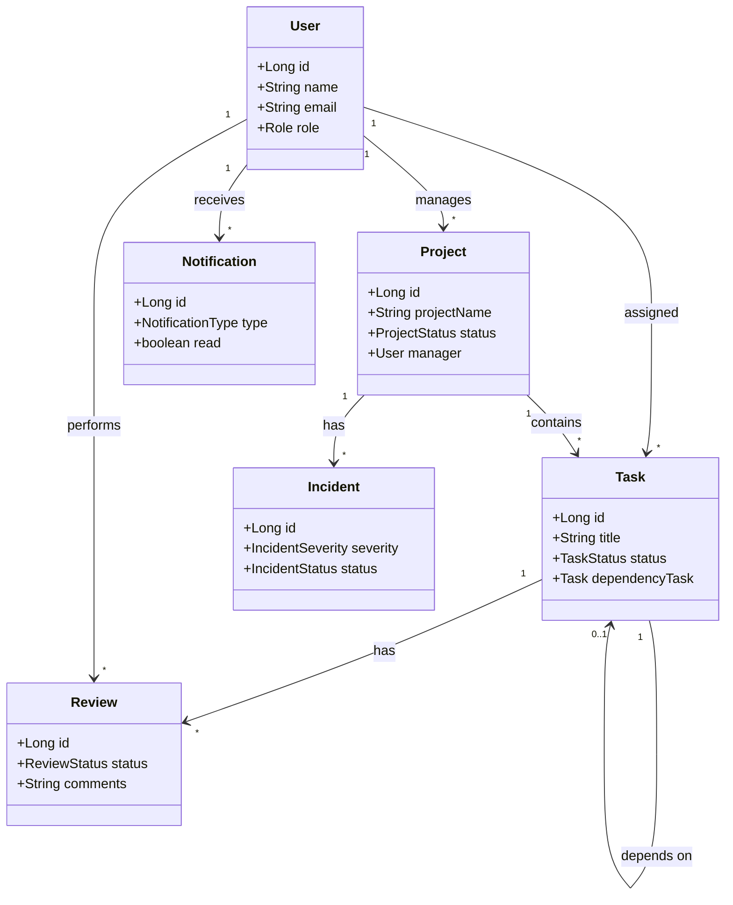

# TeamFlow - Project Management System

TeamFlow is a production-style project management application built with Spring Boot 3, MySQL, and a Bootstrap 5 + Thymeleaf frontend. It supports user management, projects, tasks with dependencies, incidents, code reviews, notifications, dashboards, and reports.

## Technologies

| Layer | Stack |
|-------|-------|
| Backend | Java 17, Spring Boot 3.5, Spring Data JPA, Spring Security |
| Database | MySQL 8 |
| Frontend | HTML, CSS, JavaScript, Bootstrap 5, Thymeleaf, Chart.js |
| Build | Maven, Lombok, Bean Validation |

## Architecture

TeamFlow follows a layered clean architecture:

```
Controller → Service (Interface) → ServiceImpl → Repository → Entity
                ↓
              DTO + EntityMapper
                ↓
           Exception Handler
```



## ER Diagram



## Sequence Diagram - Task Review Workflow



## Class Diagram (Core Domain)



## Folder Structure

```
TeamFlow/
├── src/main/java/com/example/teamflow/
│   ├── TeamFlowApplication.java
│   ├── config/           # Security, DataInitializer
│   ├── controller/       # REST + Web controllers
│   ├── dto/              # Request/Response DTOs
│   ├── entity/           # JPA entities & enums
│   ├── exception/        # Custom exceptions & handler
│   ├── repository/       # Spring Data JPA repos
│   ├── security/         # UserDetails, SecurityUtils
│   ├── service/          # Service interfaces
│   ├── service/impl/     # Service implementations
│   └── util/             # Mappers, validators
├── src/main/resources/
│   ├── application.properties
│   ├── data/sample-data.sql
│   ├── static/css/style.css
│   ├── static/js/app.js
│   └── templates/        # Thymeleaf HTML pages
├── postman/              # Postman collection
└── pom.xml
```

## Database Setup

1. Install MySQL 8 and ensure it is running.
2. Update credentials in `src/main/resources/application.properties`:

```properties
spring.datasource.url=jdbc:mysql://localhost:3306/teamflow?createDatabaseIfNotExist=true&useSSL=false&allowPublicKeyRetrieval=true&serverTimezone=UTC
spring.datasource.username=root
spring.datasource.password=root
spring.jpa.hibernate.ddl-auto=update
spring.jpa.show-sql=true
```

3. The database `teamflow` is created automatically on first run.
4. JPA generates/updates all tables via `ddl-auto=update`.

## Run Instructions

```bash
# Navigate to project
cd TeamFlow

# Build
./mvnw clean package

# Run
./mvnw spring-boot:run
```

Windows:

```cmd
mvnw.cmd clean package
mvnw.cmd spring-boot:run
```

Open **http://localhost:8080** in your browser.

### Default Login Accounts

| Email | Password | Role |
|-------|----------|------|
| admin@teamflow.com | admin123 | Admin |
| manager@teamflow.com | manager123 | Manager |
| developer@teamflow.com | dev123 | Developer |
| reviewer@teamflow.com | review123 | Reviewer |

Sample projects, tasks, and incidents are auto-seeded on first startup.

## API Endpoints

### Auth
| Method | Endpoint | Description |
|--------|----------|-------------|
| POST | `/api/auth/login` | Login (JSON) |
| GET | `/api/auth/me` | Current user profile |

### Users (Admin/Manager for write)
| Method | Endpoint | Description |
|--------|----------|-------------|
| GET | `/api/users` | List all users |
| GET | `/api/users/{id}` | Get user by ID |
| POST | `/api/users` | Create user |
| PUT | `/api/users/{id}` | Update user |
| DELETE | `/api/users/{id}` | Deactivate user |

### Projects
| Method | Endpoint | Description |
|--------|----------|-------------|
| GET | `/api/projects` | List projects |
| GET | `/api/projects/{id}` | Get project |
| POST | `/api/projects` | Create project |
| PUT | `/api/projects/{id}` | Update project |
| DELETE | `/api/projects/{id}` | Delete project |

### Tasks
| Method | Endpoint | Description |
|--------|----------|-------------|
| GET | `/api/tasks` | List all tasks |
| GET | `/api/tasks/project/{projectId}` | Tasks by project |
| GET | `/api/tasks/{id}` | Get task |
| POST | `/api/tasks` | Create task |
| PUT | `/api/tasks/{id}` | Update task |
| DELETE | `/api/tasks/{id}` | Delete task |

### Incidents
| Method | Endpoint | Description |
|--------|----------|-------------|
| GET | `/api/incidents` | List incidents |
| POST | `/api/incidents` | Report incident |
| PUT | `/api/incidents/{id}` | Update incident |
| DELETE | `/api/incidents/{id}` | Delete incident |

### Reviews
| Method | Endpoint | Description |
|--------|----------|-------------|
| GET | `/api/reviews` | List reviews |
| GET | `/api/reviews/pending` | Pending reviews |
| POST | `/api/reviews` | Create review |
| PUT | `/api/reviews/{id}` | Approve/Reject review |

### Notifications
| Method | Endpoint | Description |
|--------|----------|-------------|
| GET | `/api/notifications` | All notifications |
| GET | `/api/notifications/unread` | Unread notifications |
| GET | `/api/notifications/count` | Unread count |
| PUT | `/api/notifications/{id}/read` | Mark as read |
| PUT | `/api/notifications/read-all` | Mark all read |

### Dashboard & Reports
| Method | Endpoint | Description |
|--------|----------|-------------|
| GET | `/api/dashboard` | Dashboard metrics |
| GET | `/api/reports` | Full reports (Admin/Manager) |

## Business Rules

- **Task Dependencies**: A task cannot move to `IN_PROGRESS` until its dependency task is `COMPLETED`.
- **Status Transitions**: Valid transitions enforced via `TaskStatusValidator`.
- **Review Workflow**: Tasks moving to `IN_REVIEW` auto-create a review. Reviewer cannot review their own task. Rejected tasks return to `IN_PROGRESS`.
- **Notifications**: Triggered on task assignment, completion, review approval/rejection, and incident creation.
- **Role Permissions**: Admin/Manager manage users; Reviewer role required for review endpoints; Reports restricted to Admin/Manager.

## Frontend Pages

| Page | URL |
|------|-----|
| Login | `/login` |
| Dashboard | `/dashboard` |
| Projects | `/projects` |
| Tasks | `/tasks` |
| Users | `/users` |
| Reviews | `/reviews` |
| Incidents | `/incidents` |
| Notifications | `/notifications` |
| Reports | `/reports` |

## Postman Collection

Import `postman/TeamFlow-API.postman_collection.json` into Postman. Use session-based auth by logging in via the browser first, or call `/api/auth/login` then use cookies for subsequent requests.

## Sample SQL

Reference seed data: `src/main/resources/data/sample-data.sql`

## Future Improvements

- JWT-based stateless authentication for mobile clients
- Email notifications via Spring Mail
- File attachments on tasks and incidents
- Real-time notifications with WebSockets
- Kanban board view for tasks
- Audit logging and activity timeline
- Docker Compose for one-command deployment
- Unit and integration test coverage
- API versioning (`/api/v1/`)
- Pagination and filtering on list endpoints

## License

This project is for educational and demonstration purposes.
